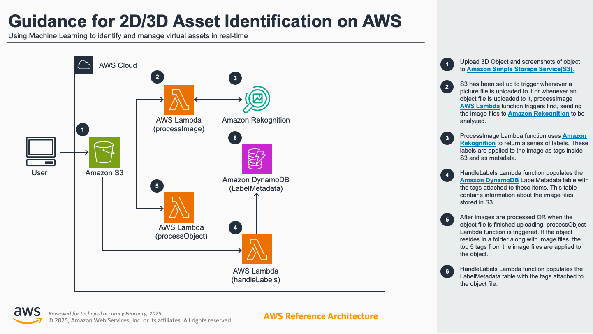

# Guidance for AIML-powered 2D/3D Asset Identification and Management

## Table of Contents

1. [Overview](#overview)
   - [Key Features](#key-features)
   - [Architecture Overview](#architecture-overview)
2. [Prerequisites](#prerequisites)
   - [Operating System](#operating-system)
   - [Tools Required](#tools-required)
   - [AWS Account Requirements](#aws-account-requirements)
3. [Deployment Steps](#deployment-steps)
   - [1. Clone the Repository](#1-clone-the-repository)
   - [2. Verify AWS CLI](#2-verify-aws-cli)
   - [3. Verify Terraform](#3-verify-terraform)
   - [4. Configure Target AWS Region](#4-configure-target-aws-region)
   - [5. Deploy The Application](#5-deploy-the-application)
4. [Deployment Validation](#deployment-validation)
   - [Outputs to Verify](#outputs-to-verify)
5. [Running the Guidance](#running-the-guidance)
   - [Expected Behavior](#expected-behavior)
   - [Outputs](#outputs)
6. [Cost](#cost)
7. [Next Steps](#next-steps)
8. [Cleanup](#cleanup)
9. [FAQ, known issues, additional considerations, and limitations](#faq-known-issues-additional-considerations-and-limitations)
    - [Known Issues](#known-issues)
10. [Notices](#notices)

</br>

## Overview 

This solution provides an automated pipeline for asset identification and management, designed specifically for game studios and traditional media industries. By leveraging AWS services, this solution allows users to process, store, and analyze both 2D and 3D assets efficiently and securely. While tailored to game studios, the solution's flexibility makes it applicable to other industries requiring robust asset management workflows.

### Key Features:
- Automated handling of asset ingestion, analysis, and metadata extraction.
- Integration with AWS services like [S3](https://aws.amazon.com/s3/), [Lambda](https://aws.amazon.com/pm/lambda/), and [DynamoDB](https://aws.amazon.com/dynamodb/) to provide a scalable and reliable architecture.
- Designed to support both 2D and 3D assets, making it versatile for different types of media.
- Fully automated workflow after deployment, requiring no additional manual intervention.

### Architecture Overview:
The solution leverages AWS’s serverless capabilities to create a highly scalable, cost-effective pipeline. Major components include:
- **Amazon S3**: For asset storage and logging.
- **AWS Lambda**: For processing assets and invoking analysis tasks.
- **Amazon DynamoDB**: For storing asset metadata.
- **Amazon Rekognition**: For advanced asset analysis.



</br>

## Prerequisites 

### Operating System 

This deployment is optimized to work best on **Amazon Linux 2**. Deployment on other operating systems may require additional steps.

### Tools Required:
- [**AWS CLI**](https://docs.aws.amazon.com/cli/latest/userguide/getting-started-install.html): Ensure it is installed and configured with access to your AWS account.
- [**Terraform**](https://developer.hashicorp.com/terraform/install): Open-source infrastructure as code (IaC) software tool from HashiCorp to define and provision the necessary resources.
- [**Node.js**](https://nodejs.org/en/download): Required for developing and testing Lambda functions locally.

### AWS Account Requirements:
- Ensure your AWS account has sufficient permissions to create and manage the following resources:
  - Amazon S3 buckets
  - AWS Lambda functions
  - Amazon DynamoDB tables
  - IAM roles

> Note: No additional resources need to be created manually beyond setting up the required AWS IAM role for deployment.

</br>

## Deployment Steps 

### **1. Clone the Repository**

   Clone the repository to your local machine:
   ```bash
   git clone <repository-url>
   cd guidance-for-aiml-powered-2d-3d-asset-identification-and-management
   ```

### **2. Verify AWS CLI**

   Verify that AWS CLI is properly configured, and that the IAM principal returned is the one you intend to use (and has the necessary permissions to build the infrastructure):
   ```bash
   aws sts get-caller-identity
   ```

### **3. Verify Terraform**

   Through your terminal window, navigate to the `deployment/src/terraform` directory in your local copy of the repo, and ensure that Terraform is installed and functioning:
   ```bash
   terraform --version
   ```
   You should get a similar output confirming your installed version:
   ```
   Terraform v1.9.4
   on darwin_arm6
   ```

### **4. Configure Target AWS Region**

   The following Terraform files are provided:

   | Terraform File  | Purpose |
   | ------------- | ------------- |
   | 1-variables.tf | Defines the region, reusable values, file zipping function, and random string generation to create globally unique resource names. Can be customized to better suit your needs |
   | 2-providers.tf | Specifies information about the plugins that allow Terraform to interact with different platforms, services, and infrastructure components |
   | 3-s3-buckets.tf | Creates the Amazon S3 bucket to be used for asset storage |
   | 4-lambdas.tf | Specifies the AWS Lambda functions to create, along with their roles, policies, and S3 event triggers to react to |
   | 5-dynamodb.tf | Creates the Amazon DynamoDB table to store the generated image metadata |

   Consider customizing the `1-variables.tf` file, especially the AWS region the infrastructure will be deployed to. 

### **5. Deploy The Application**

   Once ready and still at the `deployment/src/terraform` directory, initialize the directory: 
   ```bash
   terraform init
   ```
   This will download and install the providers used in the files. As a best practice, verify that the configuration files are syntactically valid and internally consistent:
   ```bash
   terraform validate
   ```
   When ready, apply the configuration to start creating the resources:
   ```bash
   terraform apply
   ```
   Before applying any changes or creating any resources, Terraform will print out the details of the plan and the resources it intends to create, update, and/or destroy. Confirm by typing ```yes``` when prompted, and Terraform will start to create the resources. The process should take a minute or two to finish.

</br>

## Deployment Validation 

### Outputs to Verify:
- **Terraform**: Look for an `Apply complete!` message on your terminal window listing the resources added.
- **S3 Bucket**: Ensure the specified asset storage bucket is created. If defaults left unchanged, the bucket name should have the form `image-store-bucket-XXXXXXXX`.
- **Lambda Functions**: Verify that the Lambda functions (e.g., `processImage`, `processObject`, `handleLabels`) are deployed.
- **DynamoDB Table**: Confirm the presence of the metadata table in DynamoDB. If defaults left unchanged, the table name should have the form `LabelMetadata-XXXXXXXX`.

</br>

## Running the Guidance 

### Expected Behavior:
Once deployed, the solution operates automatically, requiring no manual intervention:
1. **Asset Upload**:
   - Upload 2D or 3D assets to the designated S3 bucket.
2. **Automated Processing**:
   - Lambda functions will automatically process the assets, analyze their metadata, and store the results in DynamoDB.
3. **Logging**:
   - Dedicated logs for each Lambda function are accessible through CloudWatch Log groups.

### Outputs:
- **Metadata**: Extracted and stored in DynamoDB.
- **Processed Assets**: Accessible in the S3 bucket.

</br>

## Cost 

Based on the [AWS Pricing Calculator](https://calculator.aws/), the estimated monthly cost for this solution is **$16.48**, which primarily includes:

| Service  | Reason | Cost |
| ------------- | ------------- | ------------- |
| Rekognition Image API | 16,000 API calls for label detection. This is the dominant cost factor in the solution. | $16.00 per month (97% of total costs) |
| DynamoDB On-Demand Capacity | 1 GB of storage with minimal read/write operations. | $0.26 per month (1.6% of total costs) |
| S3 Storage and Requests | 1 GB of storage and 20,000 PUT/COPY/POST requests. | $0.12 per month (0.7% of total costs) |
| Data Transfer Costs | 5 GB inbound and 5 GB outbound data transfer. | $0.10 per month (0.6% of total costs) | 
||| **$16.48** |

</br>

## Next Steps 

- Extend the solution to include additional analysis capabilities, such as custom ML models or other [AWS AI services](https://aws.amazon.com/ai/generative-ai/).
- Integrate with external content management systems (CMS) or game engines for seamless asset management.

</br>

## Cleanup 

To avoid incurring unnecessary costs, delete the resources when they are no longer needed:

1. **Empty S3 Buckets**:
   Ensure that the S3 bucket created by the solution is emptied before deletion:
   ```bash
   aws s3 rm s3://image-store-bucket-XXXXXXXX --recursive
   ```

2. **Delete Infrastructure**:
   Use Terraform to delete all associated resources:
   ```bash
   terraform destroy
   ```
   Before destroying, terraform will ask you to confirm the action. Type `yes` to begin deleting the resources.


3. **Verify Deletion**:
   Confirm that all resources (S3 bucket, Lambda functions, DynamoDB table) have been deleted.

</br>

## FAQ, known issues, additional considerations, and limitations

### Known Issues
- Ensure all regions are supported by the services in this solution.
- Verify IAM permissions to avoid deployment errors.

</br>

## Notices 

Customers are responsible for making their own independent assessment of the information in this Guidance. This Guidance: (a) is for informational purposes only, (b) represents AWS current product offerings and practices, which are subject to change without notice, and (c) does not create any commitments or assurances from AWS and its affiliates, suppliers, or licensors. AWS products or services are provided “as is” without warranties, representations, or conditions of any kind, whether express or implied. AWS responsibilities and liabilities to its customers are controlled by AWS agreements, and this Guidance is not part of, nor does it modify, any agreement between AWS and its customers.
